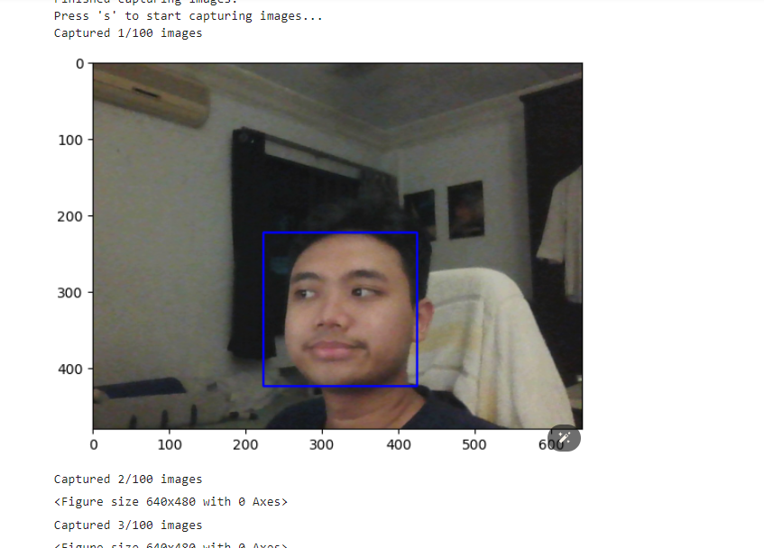

# PCA and SVM-Based Face Detection and Recognition System


## Motivation
The motivation behind this project is to develop a robust and efficient face detection and recognition system using Principal Component Analysis (PCA) and Support Vector Machine (SVM). This system aims to leverage the power of machine learning techniques to accurately detect and recognize human faces in real-time, providing a practical solution for various applications such as security, authentication, and user personalization.

## Why PCA and SVM?
### Principal Component Analysis (PCA)
PCA is a powerful dimensionality reduction technique that is used to simplify complex datasets. In the context of face recognition, PCA helps in reducing the high-dimensional data of facial images to a lower-dimensional subspace while preserving the most important features. This process is also known as the "eigenfaces" method. By focusing on the principal components, PCA enables the system to differentiate between faces based on their unique features.

### Support Vector Machine (SVM)
SVM is a supervised machine learning algorithm that is widely used for classification tasks. When combined with PCA, SVM provides a robust framework for face recognition. The reduced dimensionality data obtained from PCA is fed into the SVM classifier, which then learns to distinguish between different faces. SVM's ability to handle high-dimensional data and its effectiveness in classification tasks make it an ideal choice for this face recognition system.

## Eigenfaces Database
The project utilizes the eigenfaces approach from the `scikit-learn` library. This method is based on the idea that facial images can be projected onto a feature space (eigenspace) that best represents the variation among known face images. The eigenfaces are essentially the principal components of the set of facial images. By projecting new images onto this eigenspace, the system can recognize and differentiate between different faces.

## How It Works
1. **Data Preparation**: The system captures images of users' faces and stores them in a specified directory. Each user has a dedicated folder containing their facial images.
2. **PCA Transformation**: The captured images are transformed into a lower-dimensional subspace using PCA. This step reduces the complexity of the data while retaining the essential features for recognition.
3. **SVM Training**: The reduced-dimensionality data is used to train an SVM classifier. The SVM learns to classify different faces based on the features extracted by PCA.
4. **Face Detection and Recognition**: In the recognition phase, the system captures a new image, applies the PCA transformation, and uses the trained SVM classifier to identify the user.

## Running the Project
To run the project, clone the repository and execute the `SVM_PCA_FaceDetection.ipynb` notebook. This notebook contains all the necessary code to set up the system, capture images, train the model, and perform face recognition.

### Clone the Repository
```sh
git clone https://github.com/boss2256/PCA-SVM-FaceDetection.git
cd PCA-SVM-FaceDetection
```

### Run the Jupyter Notebook
Open the SVM_PCA_FaceDetection.ipynb notebook in Jupyter and run the cells to start the GUI. The notebook will guide you through the process of capturing images, training the model, and performing face recognition.

### Results
Finished capturing images.
```sh
              precision    recall  f1-score   support

           0       0.96      1.00      0.98        27
           1       1.00      1.00      1.00        23
           2       1.00      0.96      0.98        25

    accuracy                           0.99        75
   macro avg       0.99      0.99      0.99        75
weighted avg       0.99      0.99      0.99        75

```

## Technical Details
The system is built using the following steps:

1. **Capture Images**: Capture 100 images of a user's face using a webcam.
2. **PCA Transformation**: Apply PCA to reduce the dimensionality of the facial images.
3. **SVM Training**: Train an SVM classifier on the PCA-transformed data.
4. **Face Recognition**: Use the trained SVM model to recognize faces in real-time.

## References
- **PCA**: PCA is used to reduce the dimensionality of facial images, capturing the most significant features that differentiate one face from another. This approach is based on the concept of eigenfaces, which represent the principal components of the facial image dataset.
- **SVM**: SVM is employed to classify faces based on the features extracted by PCA. It is an effective technique for handling high-dimensional data and provides robust classification performance.

Anyone can clone this project and try it out for themselves. Simply run the cells in the `SVM_PCA_FaceDetection.ipynb` notebook to launch the GUI and start experimenting with face detection and recognition.
